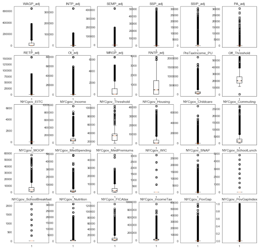

# Classification Modeling: NYC Poverty Status
Jay Kim

## Task:
Aim: To identify classifier models to predict whether an individual is or is not officially in poverty
(according to NYC government terms).
* Citywide poverty rate fell to 19% in 2017 from 20.6% in 2014...(but)
* 839,705 city students (74% of total student population) qualify for free or reduced-priced lunches, a common poverty marker and the highest percentage in over five years.
* One reason: new classification practices that have improved the ability to identify low-income kids.
* One of a growing class of city-wide datasets (via NYC OpenData)

## Data Sources
* NYC Open Data (main file: "NYCgov_PovertyStatus_2017")
* ____
* ____

## Data Science Applications Used
__Classifier Models:__
* Logistic Classifier
* KNN
* Decision Tree
* Random Forest
* Adaboost & XGBoost

__Additional Tools:__
* SMOTE
* PCA
* GridSearchCV

## Source Data:
* Inconsistent Data
* Multi-Indexed variables
Models:
* Under- / Over-Fit
* Confounding Variables, Multicollinearity
* Class Imbalance

## Modeling Overview

__Baseline Data = 68,094 total samples__

* _12,109 (~17%) qualified for Poverty Status_

__Calculating Poverty Status: Income vs. Poverty Threshold__
* _If Income < Poverty Threshold, individual qualifies for Poverty Status_
* _If Income > Poverty Threshold, individual does *not* qualify for Poverty Status_
* _Sample scales up to entire NYC Population (multiplied by specific weights for individual or household)_

## Challenges

1
2
3
4

## Final Metrics

Currently, Inconclusive Results
* Cross Validation metrics were okay, but not much better than Dummy Classifier
* To be continued:
_(even) deeper dive into data_
_Many more iterations of tuning hyper-parameters_

## Conclusions and Recommendations: Much Room for Improvement
__For me: more to come!__
_- Maximize Precision or Recall?_
   _(which is more tolerable- FP or FN?)_

__For NYC’s system:__
_- Slim down + Optimize bureaucracy-laden data structure
- Potential as Keystone / Connector Data
- Predictive Power, Systemic “Nudges”_
